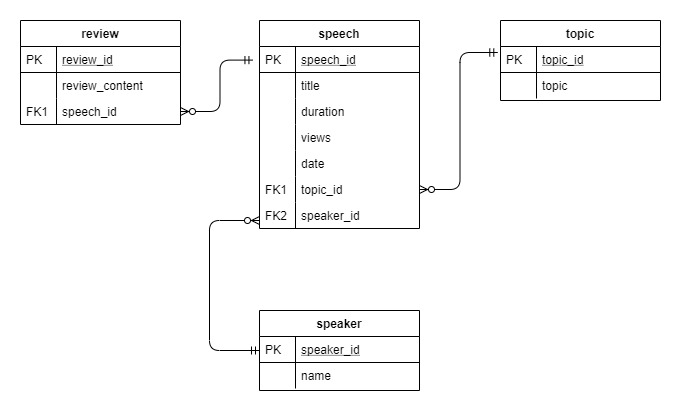

# Ted Talks Flask Application
A Flask Application that presents all speeches, reviews, relevant topics, and speakers from TED Talks in HTML webpages and REST API.

If you are interested in my analysis of data gathered from TED Talks videos, please refer to <a href="https://github.com/vbnguyen165/ted_analysis">this repository</a>.

## The Database:
Running **tedtalk_db.py** will create a database whose relationships among different entities are demonstated below.

## HTML Webpages
**tedtalk_html.py** presents information from the database as a web page using an HTML template. There is also an option to add reviews for each Ted Talk.

## REST API
- **tedtalk_api.py** provide an API for accessing and modifying the data in Ted Talk Database. 
- The file **command-line_utility.py** uses Python’s requests module to use the API to present information and add speeches from a given csv file. 
 
